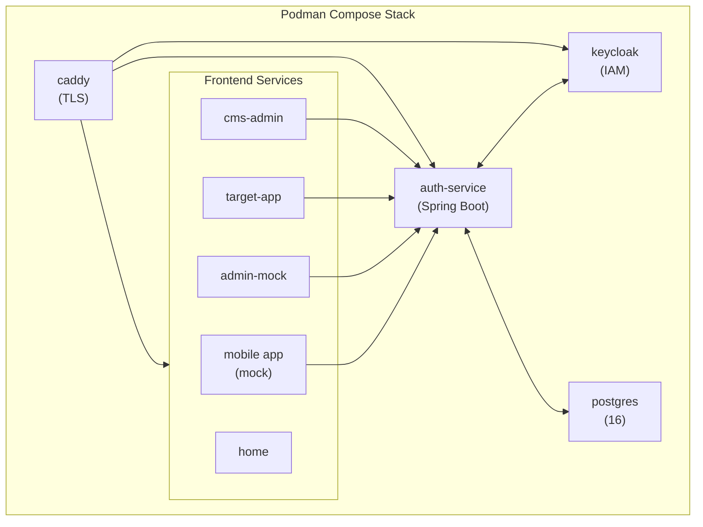
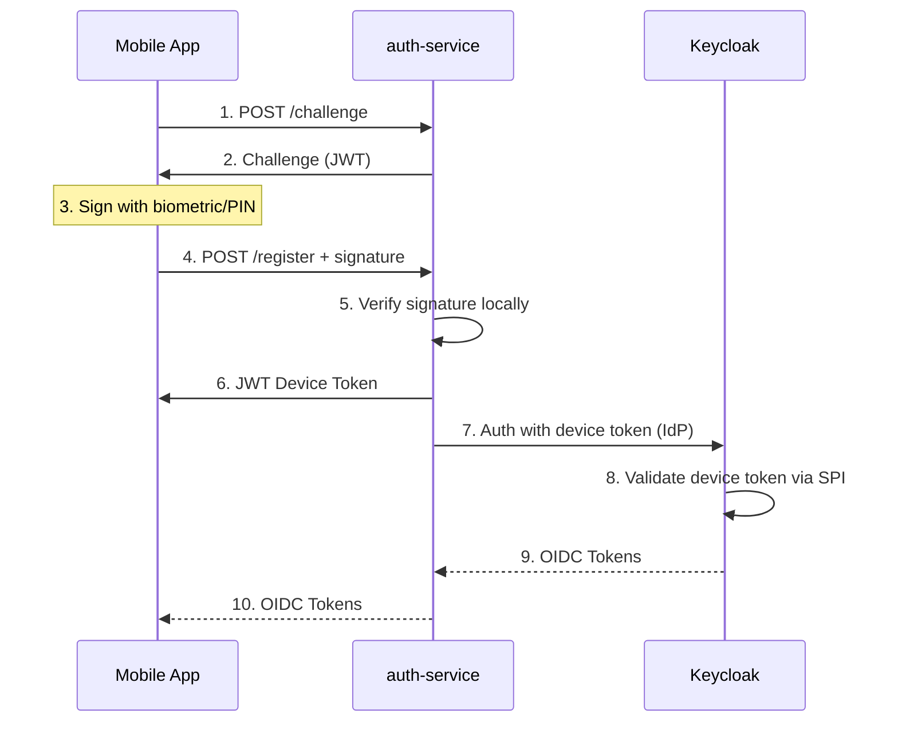
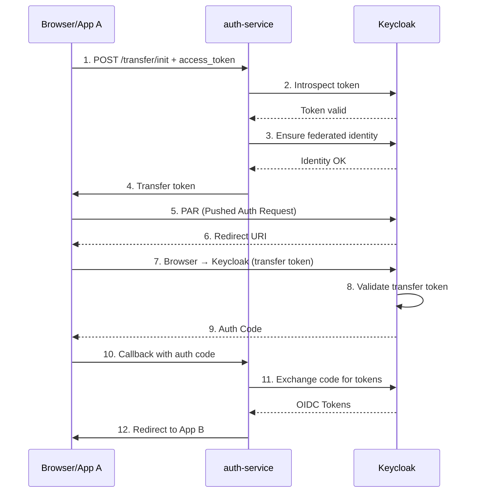
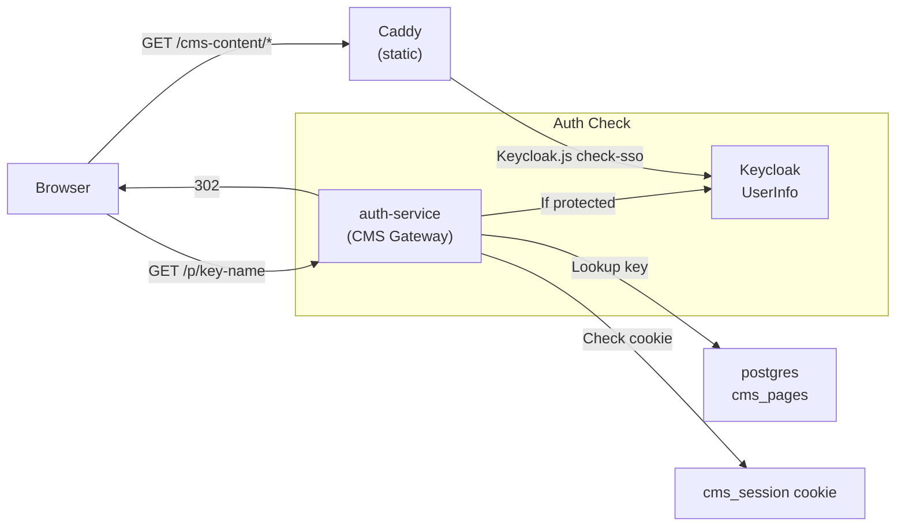

# auth-sandbox

A mobile authentication project implementing device authorization with biometric/PIN-protected keys and a CMS mock system with role-based content protection.

## Architecture Overview



## Services

| Service | Port | Description |
|---------|------|-------------|
| `postgres` | 5432 | Shared PostgreSQL 16 (Keycloak + auth-service schemas) |
| `keycloak` | 8080/8443 | Keycloak 26.x IAM |
| `auth-service` | 8083 | Spring Boot backend (device-login + SSO + CMS) |
| `caddy` | 80/443 | TLS-terminating reverse proxy |

**SPA apps served via Caddy volumes:**

| Volume Mount | URL | Description |
|--------------|-----|-------------|
| `app-mock-react/dist` | https://app-mock.localhost:8443 | Browser mock of the mobile app |
| `admin-mock-react/dist` | https://admin.localhost:8443 | Admin panel |
| `target-app-react/dist` | https://target-app.localhost:8443 | OIDC Auth Code + PKCE target SPA |
| `cms-admin-react/dist` | https://cms.localhost:8443/cms-admin/ | CMS admin panel |
| `cms-content/` | https://cms.localhost:8443/cms-content/ | Static CMS content pages |
| `home/` | https://home.localhost:8443 | Developer start page |

---

# Authentication Flows

## Flow 1: Device Authorization Grant

Mobile app registers a device, signs a challenge with a biometric/PIN-protected key, receives a JWT device token, which Keycloak exchanges for OIDC tokens via a custom SPI extension.



### Endpoints

| Method | Path | Description |
|--------|------|-------------|
| POST | `/api/v1/device/challenge` | Receive cryptographic challenge |
| POST | `/api/v1/device/register` | Register device with signed challenge |
| POST | `/api/v1/device/login` | Login with registered device |
| GET | `/api/v1/auth/.well-known/jwks.json` | JWKS for token verification |

---

## Flow 2: SSO Transfer

Browser-based SSO handoff: an existing OIDC session is transferred to a second app using a short-lived transfer token and Keycloak's PAR + JWT Authorization Grant features.



### Endpoints

| Method | Path | Description |
|--------|------|-------------|
| POST | `/api/v1/transfer/init` | Initialize SSO transfer |
| GET | `/api/v1/transfer/callback` | Keycloak callback with auth code |
| GET | `/api/v1/transfer/.well-known/jwks.json` | JWKS for transfer tokens |

---

## Flow 3: CMS Mock

A CMS mock system with role-based content protection. Pages are accessed via short URLs with keys, and protection levels are enforced using Keycloak authentication and Step-up authentication (ACR).

### Protection Levels

| Level | Meaning | Behavior |
|-------|---------|----------|
| `public` | No auth required | Direct 302 redirect to content |
| `acr1` | Password login (LoA 1) | UserInfo check; if `acr < 1` → Keycloak redirect |
| `acr2` | MFA (LoA 2) | UserInfo check; if `acr < 2` → Step-up redirect |

### Architecture



### Full Auth Flow (12 Steps)

```
Step 1:  Browser GET https://cms.localhost:8443/p/prm001-premium
Step 2:  Caddy proxy /p/* → auth-service:8083
Step 3:  CmsController.resolve(key, name)
         - DB-Lookup: protection_level, content_path
         - Read cms_session cookie

Step 4:  protection_level == "public"
         → 302 to https://cms.localhost:8443/cms-content/index.html

Step 5:  No cookie for acr1/acr2 → Go to Step 6

Step 6:  Cookie present:
         a) GET UserInfo with Bearer token
         b) 401 → Go to Step 7
         c) Check acr claim:
            - acr1: acr >= 1 → 302 to premium.html
            - acr2: acr >= 2 → 302 to admin.html
            - acr too low → Go to Step 7

Step 7:  302 to Keycloak Auth Endpoint
         ?client_id=cms-client
         &redirect_uri=https://cms.localhost:8443/cms/callback
         &response_type=code
         &acr_values={1|2}
         &state={Base64(return_url)}

Step 8:  User authenticates (password, OTP for acr2)

Step 9:  Keycloak → GET /cms/callback?code=...&state=...

Step 10: CmsController.callback:
         a) POST token endpoint (code → access_token)
         b) Set cookie: cms_session={token}; HttpOnly; Secure
         c) 302 to return_url

Step 11: Browser GET /p/prm001-premium (with cookie)
         → Steps 3-6: UserInfo OK, acr >= 1 → 302

Step 12: Browser GET /cms-content/premium.html
         → Caddy serves static HTML
         → Keycloak.js check-sso → authenticated=true
```

### Keycloak Clients

| Client ID | Type | Redirect URI(s) | Usage |
|-----------|------|-----------------|-------|
| `cms-client` | CONFIDENTIAL | `https://cms.localhost:8443/cms/callback` | Server-side code exchange |
| `cms-public-client` | PUBLIC | `https://cms.localhost:8443/cms-content/index.html` | Keycloak.js check-sso |
| `cms-premium-client` | PUBLIC | `https://cms.localhost:8443/cms-content/premium.html` | Keycloak.js check-sso |
| `cms-admin-client` | PUBLIC | `https://cms.localhost:8443/cms-content/admin.html` | Keycloak.js check-sso |

### Database Model

```sql
CREATE TABLE device_login.cms_pages (
    id               UUID         PRIMARY KEY DEFAULT gen_random_uuid(),
    name             VARCHAR(100) NOT NULL,
    key              VARCHAR(8)   NOT NULL UNIQUE,
    protection_level VARCHAR(20)  NOT NULL DEFAULT 'public',
    content_path     VARCHAR(255) NOT NULL,
    created_at       TIMESTAMP    DEFAULT NOW()
);
```

### CMS Endpoints

| Method | Path | Description |
|--------|------|-------------|
| GET | `/p/{key}-{name}` | Check protection → redirect to content or Keycloak |
| GET | `/cms/callback` | OAuth2 callback → code exchange → cookie → redirect |
| POST | `/api/v1/cms/pages` | Create page (HTTP Basic Auth) |
| GET | `/api/v1/cms/pages` | List pages (HTTP Basic Auth) |
| DELETE | `/api/v1/cms/pages/{id}` | Delete page (HTTP Basic Auth) |

---

# Repository Structure

| Directory | Purpose |
|-----------|---------|
| `auth-service/` | Spring Boot 3 / Java 21 — merged backend (device-login + SSO + CMS) |
| `keycloak-extension/` | Keycloak SPI (`LoginTokenAuthenticator`) |
| `app-mock-react/` | React/TS/Vite/Tailwind — mobile app mock |
| `admin-mock-react/` | React/TS/Vite/Tailwind — admin panel |
| `target-app-react/` | React/TS/Vite/Tailwind — OIDC target SPA |
| `cms-admin-react/` | React/TS/Vite/Tailwind — CMS admin panel |
| `cms-content/` | Static HTML content pages |
| `c4-spec/` | LikeC4 architecture diagrams |
| `tofu/` | OpenTofu — Keycloak realm setup |
| `compose.yml` | Podman Compose stack (5 services + frontend volumes) |
| `Caddyfile` | Caddy reverse proxy — TLS for `*.localhost` |
| `.env` / `.env.example` | Secrets (`.env` not committed) |

---

# Quick Start

```bash
# 1. /etc/hosts (one-time)
echo "127.0.0.1  keycloak.localhost" | sudo tee -a /etc/hosts
echo "127.0.0.1  auth-service.localhost" | sudo tee -a /etc/hosts
echo "127.0.0.1  sso-proxy.localhost" | sudo tee -a /etc/hosts
echo "127.0.0.1  app-mock.localhost" | sudo tee -a /etc/hosts
echo "127.0.0.1  admin.localhost" | sudo tee -a /etc/hosts
echo "127.0.0.1  target-app.localhost" | sudo tee -a /etc/hosts
echo "127.0.0.1  home.localhost" | sudo tee -a /etc/hosts
echo "127.0.0.1  cms.localhost" | sudo tee -a /etc/hosts

# 2. Copy and edit .env
cp .env.example .env

# 3. Generate RSA keys
mkdir -p auth-service/keys
openssl genrsa -out auth-service/keys/private.pem 4096
openssl rsa -in auth-service/keys/private.pem -pubout -out auth-service/keys/public.pem

# 4. Build Keycloak extension
cd keycloak-extension && ./gradlew jar && cd ..

# 5. Start stack
podman compose up -d

# 6. Configure Keycloak realm (see SETUP.md)
```

---

# Access URLs

| URL | Description |
|-----|-------------|
| https://home.localhost:8443 | Developer start page |
| https://keycloak.localhost:8443 | Keycloak Admin UI |
| https://auth-service.localhost:8443/actuator/health | auth-service health |
| https://admin.localhost:8443 | Admin mock panel |
| https://app-mock.localhost:8443 | Mobile app mock |
| https://target-app.localhost:8443 | SSO transfer target |
| https://cms.localhost:8443 | CMS content pages |
| https://cms.localhost:8443/cms-admin/ | CMS admin panel |

---

# Build & Test Commands

## React Apps
```bash
cd app-mock-react && npm run build
cd admin-mock-react && npm run build
cd target-app-react && npm run build
cd cms-admin-react && npm run build
```

## React Tests (Playwright)
```bash
cd app-mock-react && npm test
cd admin-mock-react && npm test
cd target-app-react && npm test
cd cms-admin-react && npm test
```

## auth-service
```bash
cd auth-service && ./gradlew bootJar
cd auth-service && ./gradlew test
```

## keycloak-extension
```bash
cd keycloak-extension && ./gradlew jar
```

---

# Security Conventions

- Never log secrets, tokens, passwords, or private keys
- Never commit secrets — use environment variables
- Cryptographic operations must use well-vetted libraries
- JWT validation must verify signature, `exp`, `aud`, and `iss`
- Device tokens are sensitive; treat with same care as OIDC tokens
